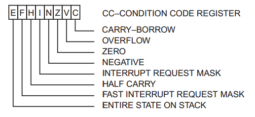

```
0000: 1A 50        ORCC #$50   Set condition codes to disable IRQ
```

The Motorola 6809 has the following condition codes ([source](http://retro.co.za/6809/documents/Byte_6809_Articles.pdf "source")):



The ORCC command will perform a logical OR on the register with a byte, allowing any of these flags to be set manually. In this case the bitmask of 0x50 is:

`0101 0000`

which corresponds to these two flags:

 - **INTERRUPT REQUEST MASK**
 -  **FAST INTERRUPT REQUEST MASK**

As far as I understand, the latter is just a higher priority interrupt.

Presumably interrupts are disabled as a safety measure, so that all keyboard/joystick inputs are disabled during initialization.
