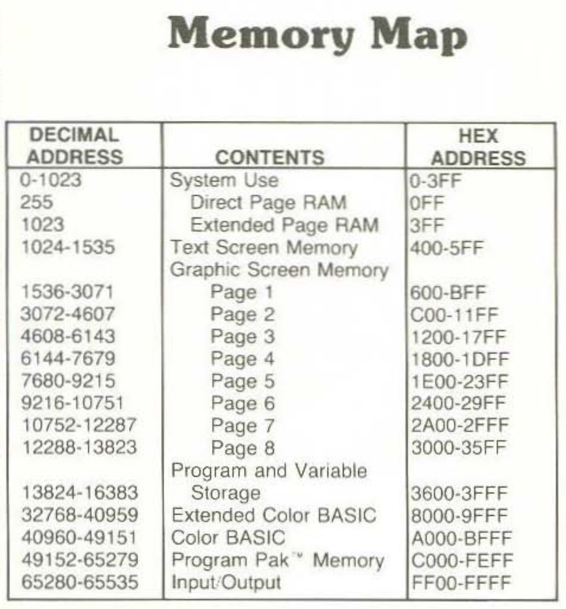

Here's our first line of code:

```
C000: 1A 50        ORCC #$50   Set condition codes to disable IRQ
```

We start execution at address `$C000`.

### C000?! Why C000?!
You might expect that when you turn the computer on it'd be sensible to start executing instructions from memory address `$0000`. The 8080, Intel's second ever 8-bit CPU created in 1974, did actually start reading from `$0000`. Later microprocessors would start execution at the *end* of memory; Intel's iconic 8086, the very first x86 processor, starts execution at `$FFFF0` while the Motorola 6809, used in the CoCo itself, starts execution at `$FFFE`.

In that case, why doesn't our code begin at `$FFFE`? Because our game is not the first piece of code to run when we switch the machine on. We have to remember that our game code is not part of the CoCo itself, but sitting in the circuits of the plastic cartridge that we've pushed into the box, so we shouldn't really expect to be given the honour of being mapped to the prime position of `$FFFE`. We can see where it's actually addressed by looking at the simplified CoCo memory map:



Our plastic cartridge is the **Program Pak™ Memory**, which the map tells us resides at `$C000`. Hence, our program starts directly at `$C000`.

### Condition Codes
The Motorola 6809 has the following condition codes ([source](http://retro.co.za/6809/documents/Byte_6809_Articles.pdf "source")):


The ORCC command will perform a logical OR on the register with a byte, allowing any of these flags to be set manually. In this case the bitmask of 0x50 is:

`0101 0000`

which corresponds to these two flags:

 - **INTERRUPT REQUEST MASK**
 -  **FAST INTERRUPT REQUEST MASK**

As far as I understand, the latter is just a higher priority interrupt.

Presumably interrupts are disabled as a safety measure. We're not yet ready to handle any keyboard or joystick button presses the player gives us, so we disabled all inputs until initialization is complete.