```
C00D: BD D7 B2     JSR $17B2   Jump to initialize_video()
```

This first part of this subroutine, which I've named `initialize_video()` because I know that we're setting up the video display, is shown below.

```
D7B2: 8E FF C6     LDX #$FFC6   Address for SAM VDG display offset
D7B5: 86 03        LDA #$03     Set A to 3 (binary 000 0011)
D7B7: C6 07        LDB #$07     Set B to 7
D7B9: 8D 12        BSR $17CD    Set SAM, 7 bits with mask 000 0011
```

"Hang on a minute," you say. "What's this 'SAM'? What's this 'VDG'? What are we doing here?". Fair questions, which require a diversion into how video works for the CoCo.

## How video works on the CoCo

The component responsible for rendering video is the Motorola MC6847 Video Display Generator (VDG).

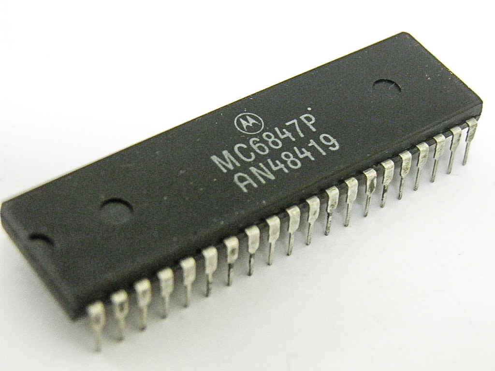

While modern video cards have their own on-board memory, the VDG reads directly from the same RAM used by the CPU. First you initialize the chip with a display mode and the address at which video data will be stored in RAM. It then sequentially reads all of the screen data from the RAM (between 512 and 6,144 bytes, depending on the display mode set during initialization) and sends that to the monitor. For an NTSC output (i.e. your average TV screen), it reads and sends the data in sync with the rasterization process i.e. 60 times a second.

What is the data in video RAM, and how does that translate to what's shown on-screen? The VDG provides a resolution of 256 x 192, for a total of 49,152 pixels. A modern-day computer could easily spare 3 bytes (24-bit, "true color") per pixel, for a total requirement of 144K. Your average CoCo might only have 16K of RAM in total, so that's out of the question; at maximum resolution, we can really only afford 1 *bit* per pixel, for a maximum requirement of 6,144 bytes (6K) of RAM.

Of course, if we want any color (and this is the "Color Computer") we have to spare at least a couple of bits per pixel. To accomodate our limited resources, the VDG has 14 modes of varying colors and resolutions, outlined below:

### Alphanumeric and "semi-graphics" modes
These aren't of much interest to us as they mostly display text and very crude graphical blocks.

 - ALPHANUMERIC INTERNAL - 32 x 16 characters, 2-color, each byte is an ASCII character. Uses 0.5K RAM.
 - ALPHANUMERIC EXTERNAL - 32 x 16 characters, 2-color, each byte is a custom character. Uses 0.5K RAM.
 - SEMIGRAPHICS 4 - 64 x 32, 8-color. Uses 0.5K RAM.
 - SEMIGRAPHICS 6 - 64 x 48, 4-color. Uses 0.5K RAM.

(There are also SEMIGRAPHICS 8, 12 and 24, not in the VDG manual. I couldn't actually recreate these modes in the emulator and I'm not sure how capable the CoCo was of actually using it).

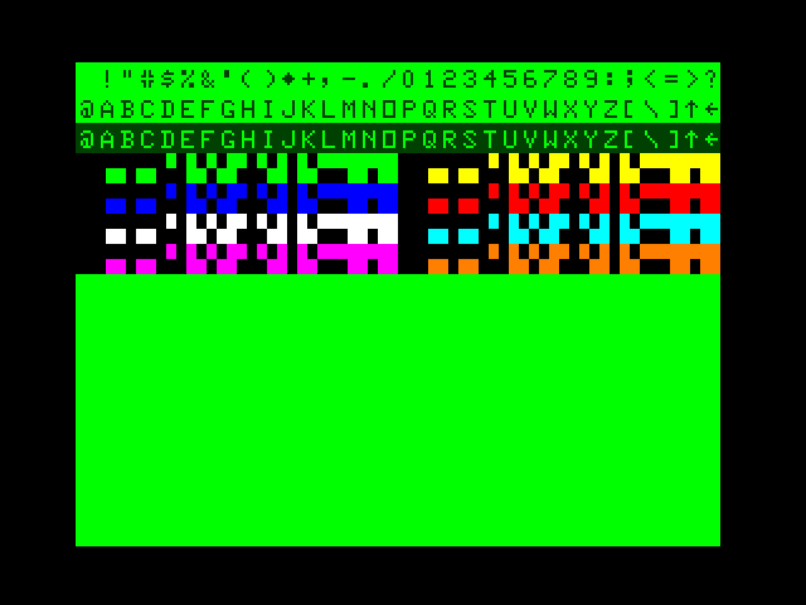
<sub><sup>([source](http://commons.wikimedia.org/wiki/File:Cocobvdg.png#mediaviewer/File:Cocobvdg.png))</sup></sub>

### Resolution modes
These aren't of much interest for games either as you only get 2 colors. I can't think of any programs that actually use it, though looking at the manuals it may have been the only way to get black and white (or rather, "buff") together on-screen.

 - RESOLUTION GRAPHICS 1 - 128 x 64, 2-color. Max 1K RAM.
 - RESOLUTION GRAPHICS 2 - 128 x 96, 2-color. Max 1.5K RAM.
 - RESOLUTION GRAPHICS 3 - 128 x 192, 2-color. Max 3K RAM.
 - RESOLUTION GRAPHICS 6 - 256 x 192, 2-color. Max 6K RAM.

### Color modes
Much more interesting as you get 4 vibrant colors to play with.

 - COLOR GRAPHICS 1 - 64 x 64, 4-color. Max 1K RAM.
 - COLOR GRAPHICS 2 - 128 x 64, 4-color. Max 2K RAM.
 - COLOR GRAPHICS 3 - 128 x 96, 4-color. Max 3K RAM.
 - COLOR GRAPHICS 6 - 128 x 192, 4-color. Max 6K RAM.

There are two palettes to choose from; the extremely vibrant green/yellow/blue/red:

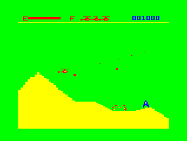

and the somewhat upsetting buff/cyan/magenta/orange. The game I most distinctly remember that really embraced the latter palette was the (aptly named) Pooyan port.

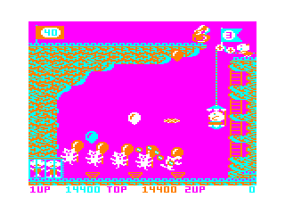

Most games on cartridge that I remember would have used CG6 i.e. the maximum resolution. I guess the only reason you wouldn't is to support those with only 4K of RAM.

### The SAM
What, another chip?

Yes. The MC6883 Synchronous Address Multiplexer (SAM).

As far as I understand, while the main point of the SAM is act as a RAM controller, the sophisticated bit is that it synchronizes the CPU, the RAM and the VDG to work nicely together. Consider that the VDG needs to read up to 6,144 bytes from RAM, 60 times a second. This is fine, except that the CPU also needs frequent (and uncontended) access to RAM. A fight is clearly brewing.

The SAM cleverly steps around this issue by *interleaving* CPU and VDG accesses within the same machine cycle. It so happens that all CPUs compatible with the SAM only access memory in the *latter* half of the machine cycle. The VDG is therefore free to access the RAM in the *former* half of the machine cycle.

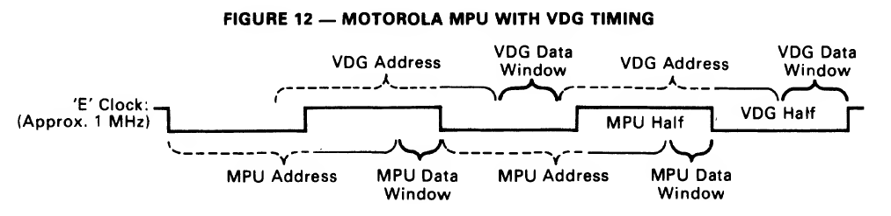

### Initializing the VDG via the SAM
The graphics mode is controllable . It also has to be set in the SAM, via a 3-bit value addresses 0xFFC0 to 0xFFC5.

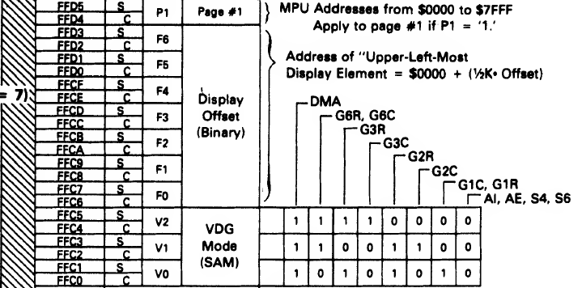

The subroutine at $17CD, I'll call `write_to_SAM_register()`:

```
D7CD: 46           RORA        
D7CE: 24 06        BCC $17D6   Branch if carry-bit 0
D7D0: 30 01        LEAX +$01,X 
D7D2: A7 80        STA ,X+     
D7D4: 20 02        BRA $17D8
D7D6: A7 81        STA ,X++ 
D7D8: 5A           DECB
D7D9: 26 F2        BNE $17CD  Next B (i.e. return to top)
D7DB: 39           RTS
```

As I discovered later, this piece of code is the idiomatic way to set these bits on the SAM, and is actually listed almost exactly as above on page 16 of the MC6883 technical specs.

I rewrote this function in C, once loosely mimicking the ASM instructions, and then again at a "higher level" just trying to recreate the functionality. Neither is very satisfying, mostly because you're ultimately 

## VDG Address Offset
The addresses 0xFFC6 - 0xFFD3 are mapped to the VDG Address Offset, which indicates the starting address in RAM for video data. It's set in a kinda weird way; individual bits are set by writing to particular bytes of mapped memory:

 - Set any data on 0xFFC6 = clear bit 0
 - **Set any data on 0xFFC7 = set bit 0**
 - Set any data on 0xFFC8 = clear bit 1
 - **Set any data on 0xFFC9 = set bit 1**
 - **Set any data on 0xFFCA = clear bit 2**
 - Set any data on 0xFFCB = set bit 2
 - **Set any data on 0xFFCC = clear bit 3**
 - Set any data on 0xFFCD = set bit 3
 - **Set any data on 0xFFCE = clear bit 4**
 - Set any data on 0xFFCF = set bit 4
 - **Set any data on 0xFFD0 = clear bit 5**
 - Set any data on 0xFFD1 = set bit 5
 - **Set any data on 0xFFD2 = clear bit 6**
 - Set any data on 0xFFD3 = set bit 6

Now recall again the first part of the subroutine we were looking at:

```
D7B2: 8E FF C6     LDX #$FFC6   Address for SAM VDG display offset
D7B5: 86 03        LDA #$03     Set A to 3 (binary 000 0011)
D7B7: C6 07        LDB #$07     Set B to 7
D7B9: 8D 12        BSR $17CD    Set SAM, 7 bits with mask 000 0011 at address 0xFFC6
```

The bold text in the list above indicates the locations that we end up writing to in Starblaze's case, when we set the seven bits of the VDG display offset to 3 (`000 00111`). 

What does the offset of "3" actually mean for the RAM? Well, the offsets are measured in 512 byte chunks. This means that the data begins at 3 x 512 = 1536, or 0x0600. Therefore the data beginning from 0x600 corresponds directly to the output at the upper-left corner of the screen. As it happens this makes sense, as 0x0600 is precisely where the technical documents state that system-reserved RAM ends and the graphics page areas begin.

The amount memory dedicated to video display from that offset depends on which video mode is set, for example:

 - for the lowest resolution modes it will use the next 512 bytes (0x0600---0x0800)
 - for the highest resolution modes it will use the next 6,144 bytes (0x0600---0x1E00)


## VDG Modes
We then use the same technique on a different address:

```
D7BB: 8E FF C0     LDX #$FFC0  Address for SAM VDG mode
D7BE: 86 06        LDA #$06    Set A to 6 (binary 110)
D7C0: C6 03        LDB #$03    Set B to 3
D7C2: 8D 09        BSR $17CD   Set SAM, 3 bits with mask 110
```

The bits 110 correspond to video mode "CG6", which is definitely the best for games at 128 x 192 with 4 colors.

## VDG Modes via I/O mappings
```
D7C4: B6 FF 22     LDA $FF22  Address for SAM input/output interfaces
D7C7: 8A E0        ORA #$E0   New SAM, 8 bits with mask 1110 0000
D7C9: B7 FF 22     STA $FF22  
D7CC: 39           RTS
```

We may notice in the previous section that setting 3 bits on the SAM is not actually enough to specify the exact mode that we want; the inputs to the VDG also need to be configured.

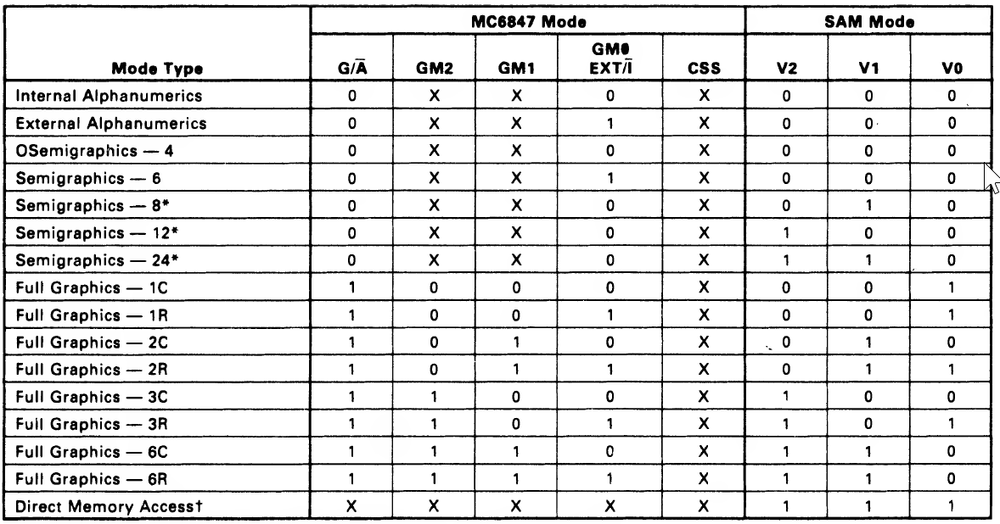

Indeed the mask that we set on V0, V1 and V2, `110`, could specify CG6 (COLOR GRAPHICS SIX) or RG6 (RESOLUTION GRAPHICS SIX). The only thing separating the two is the bit for `GM0`, which is configured not on the SAM but on the VDG.

How do we configure the flags on the VDG? It seems that we still do this *via* the SAM, in this case via the SAM I/O memory mappings in the range FF00 to FF5F:


The code specifically sets the byte at `FF22`. According to the detailed memory map for this address:

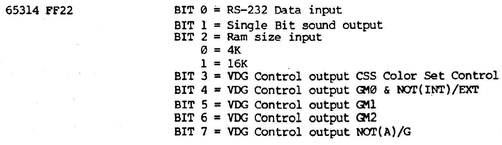

a mask of `1110 0000` would set:

 - VDG control output GM1 = 1
 - VDG control output GM2 = 1
 - VDG control output NOT(A)/G = 1

This ensures that the graphics mode is set to 128 x 192, 4-color mode.

Note that when running in MESS, during load the mask is already set to `0000 0100`, which indicates 16K of memory vs 4K. We load and then OR the byte from `FF22` so that we don't lose existing flags like this.

## Fun with video modes
Now that we know how the video mode is set, we can mess up the game in all sorts of interesting ways just by changing a single byte.

If we change 0x17C8 from E0 to F0 we switch from COLOR GRAPHICS SIX to RESOLUTION GRAPHICS SIX:

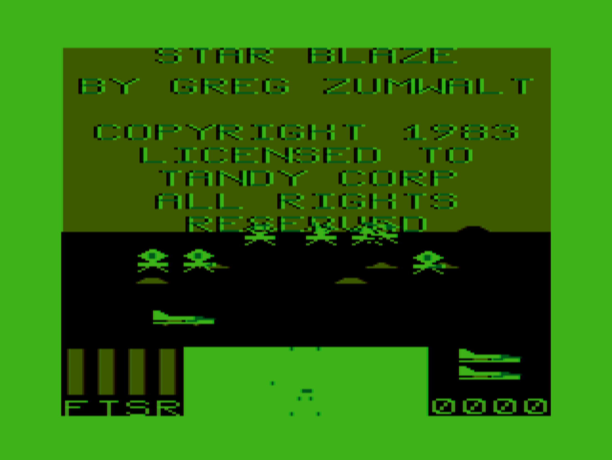

If we change 0x17C8 from E0 to C0, and 0x17BF from 06 to 04, we get COLOR GRAPHICS THREE:

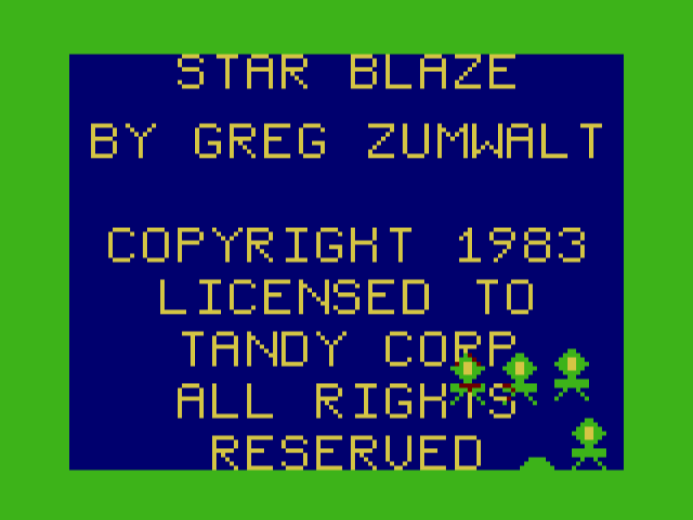

Finally, if we change 0x17C8 from E0 to 00, we get SEMIGRAPHICS TWELVE:

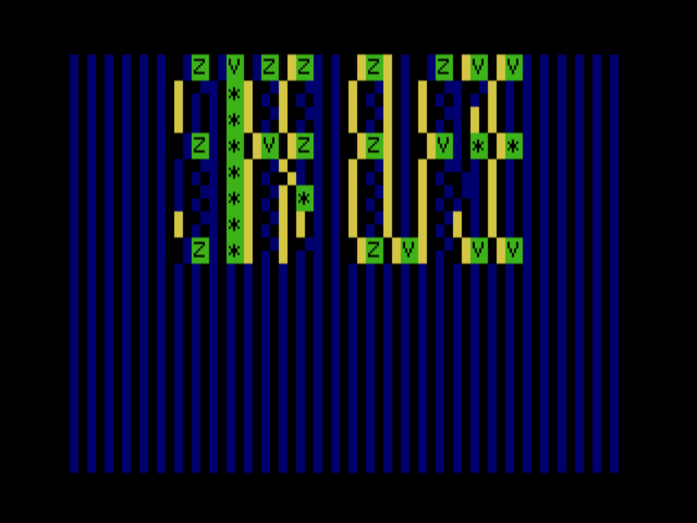

I'm impressed that the game still runs, and you can almost make out the title.
