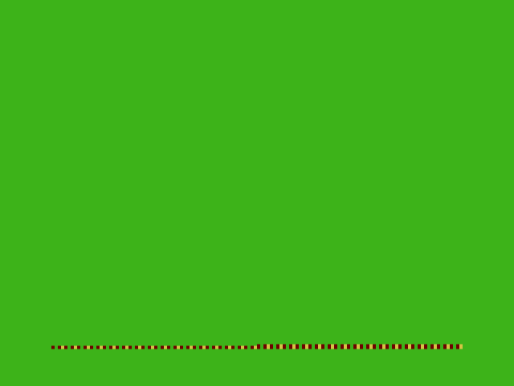

```
C015: 10 CE 3F FF  LDS #$3FFF  Set stack pointer to 0x3FFF
C019: BD D7 DC     JSR $17DC   Jump
```

The `LDS` instruction sets the memory location for our stack to 0x3FFF. Choosing this particular address is somewhat arbitrary; it just needs to be somewhere that won't be used by anything else.

The stack can be used for different things, but in this context the only thing we need to mention is that, when we allow CPU execution to jump to new locations, the stack will keep track of where we were. This is known as a *call stack*. For example:

 - following the `JSR` (Jump To Subroutine) command, the address `0028` will be automatically stored at 0x3FFD, and the stack register S will point to 0x3FFD.
 - following the next `RET` (Return) command, execution will return to 0x0028 and the stack register S will point to 0x3FFF again.

Notice that the stack grows *downwards*, so 0x3FFF points to the top of the stack, and anything added to the stack is added at memory addresses below that.

The subroutine at $17DC looks like this:

```
D7DC: 8E 06 00     LDX #$0600
D7DF: CC 00 00     LDD #$0000
D7E2: ED 81        STD ,X++ 
D7E4: 8C 1E 00     CMPX #$1E00
D7E7: 26 F9        BNE $17E2
D7E9: 39           RTS
```

Huh. So this basically starts at address 0x0600 - which we established was the start of video memory - and zeroes out all the bytes until 0x1E00. Funny, I always thought that zeroing out memory could be done in a single bulk operation somehow, but nope, we have to loop 3,072 times, zeroing out 2 bytes at a time.

It's no coincidence that we're zeroing out exactly 6K of RAM. We previously established that the video RAM would start at 0x0600, and that the COLOR GRAPHICS SIX mode would use 6K of RAM.

In other words, we've turned the whole screen green.

## Why is my screen not completely green?
Interestingly, even after doing this there are still some random artifacts on the screen:



Remember that CRT televisions and monitors have an electron gun that fires horizontal beams at the screen, moving back and forth from top-to-bottom? I'm guessing that these artifacts are random bits of data in the video RAM which were there before the memory was cleared, but are still visible simply because those scan-lines have not been reached yet. This is not something I'm used to the in modern era, where the entire screen's data is usually buffered before being displayed.
