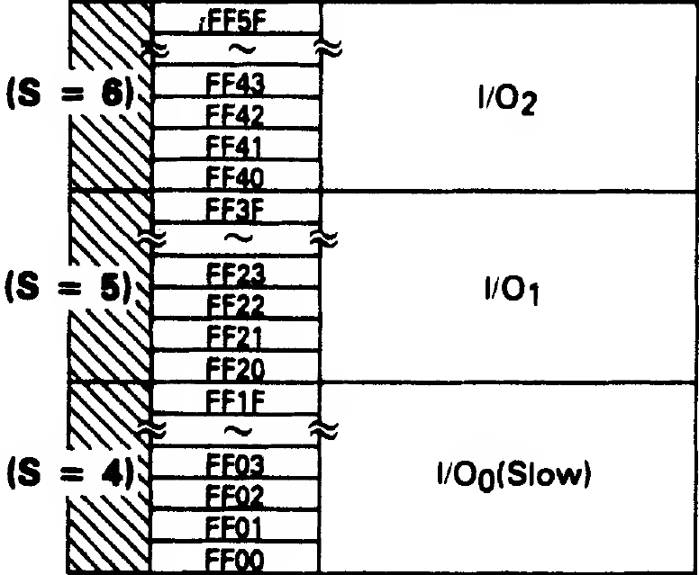

```
0032: B6 FF 03     LDA $FF03   Load data from 0xFF03
0035: 8A 01        ORA #$01    Set bit 0 (OR on 0000 0001)
0037: B7 FF 03     STA $FF03   Save back to RAM
```

Here we're writing a mask to the I/O system via the SAM again, just as we did before [to set the VDG mode](). This time it corresponds to the **I/O<sub>0</sub> (Slow)** flags.



Again, the detailed memory map comes to the rescue:


So we're enabling "IRQ to CPU" for the field sync. A field sync is the same as a vertical sync (VSYNC); this is the small pause that occurs 60 times a second, once the electron beam has drawn the entire screen (all 525 horizontal lines) and is returning to the upper-left corner. An interrupt signal that it sends at this time is most usefully read as a message from the video controller saying, **"Hey! I've drawn the whole screen but I haven't started on the next one yet; if there are any changes you want to make for the next screen, now might be a good time to do it."**

It might be useful to see what happens to the game if we *don't* allow the CPU to be notified of the VSYNC. To get a better idea of what this does I tried setting the byte at 0x36 from `01` to `00`, which causes the code to do nothing and keeps the IRQ to CPU disabled. What happened was this:


We get the basics of the HUD displayed, but nothing else. The game appears to be otherwise locked on this screen. I would guess this means that the program is actually waiting for the VSYNC signal before proceeding. It likely does this because writing to the video RAM at the same time that it's being rendered to screen is not usually a great idea (you might end up drawing half of the previous state and half of the new state).