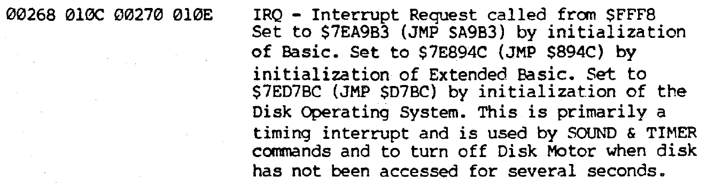

```
C03D: 8E C2 7C     LDX #$C27C  
C028: BF 01 0D     STX $010D   Set 0x010D to C2 7C (pointer to 0xC27C)
```

We're writing some bytes to 0x010D, so first things first: what's at that location?



This lies amidst a larger collection of "interrupt vectors", which basically just tells us what to do when the CPU is interrupted by an external event. This is the IRQ interrupt vector, which means that a hardware event - [such as a VSYNC]() - will cause execution to jump to 0x010C.

Once we're at 0x010C, we only have 3 bytes before the next piece of (unrelated) system code; we don't want to let the CPU keep running into that code, so for practical purposes the only thing we can do in such a limited space is jump to another function. In fact this is so common that we assume that the op-code byte at 0x010C is already set to `JMP` (7E), and don't bother setting it. Instead we just set the address for the `JMP` at 0x010D.

In short, whenever a hardware interrupt occurs, execution will jump to 0xC27C.

### A note on pointers
Here we're loading an address in the X register, but for the first time, rather than saving the *value* at that location we're actually writing the *address* itself to 0x010D. This is basically what a **pointer** in any higher-level language is; not a value, but the address pointing to that value.

Typically, when learning a language like C, we first encounter pointers to simple variables. In this case, however, 0xC27C is not a variable, but executable code i.e. the starting point of another function.

In other words, in our 6 bytes of code we've written a function pointer (albeit one at a fixed location).

It's gnarly that pointers (let alone function pointers) can be difficult for learner programmers starting in a high-level language, but in assembly both the concept and the implementation are very straightforward to understand.
