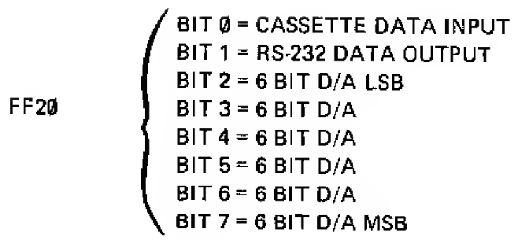
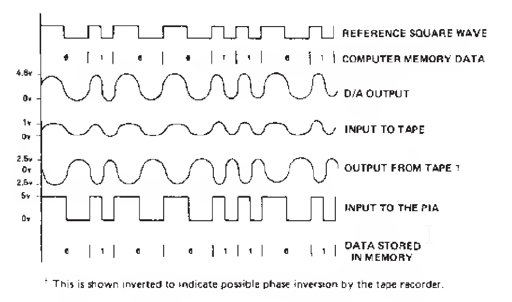

```
C02B: B6 FF 20     LDA $FF20	Load 0xFF20
C02E: 84 03        ANDA #$03	Zero bits 2,3,4,5,6,7
C030: B7 FF 20     STA $FF20	Store
```

Here we AND the value at 0xFF20 against the bitmask `0000 0011`, which sets all of the bits of the 6-bit D/A to 0. 



What's the "6-bit D/A"? The "D/A" stands for "digital-to-analog converter". At a technical level, this converts the six-bit input (i.e. a number between 0 and 63) and converts it to a voltage (in this case, between 0.25 volts and 4.75 volts). It appears to be a linear conversion; the approximate voltage can be determined by the formula <span>$V = (n\times0.0715) + 0.25$</span>:

<div>$$
V = (0\times0.0715) + 0.25 = 0.25
$$</div>

<div>$$
V = (63\times0.0715) + 0.25 \approx 4.75
$$</div>

Not that the specific voltages are important for what we're doing... but what is this analog output used for?

### Cassette output
Though we always played Starblaze from a cartridge, most of our games and other programs were saved on standard audio cassette tapes. I never really knew how that worked; how do you store a program as sound?

Once I knew (vaguely) the difference between analogue and digital I was even more confused: how can we store digital data, which is ultimately just discrete ones-and-zeroes, on an analogue medium, which stores sound in a very non-discrete manner i.e. with an effectively infinite resolution?

It turns out to be fairly straightforward and it's been explained on page 32 of the TRS-80 Color Computer Technical Reference Manual for at least the last thirty five years:



In brief:
 1. If you want to save a 0 to tape, generate one cycle of a 1200Hz sine wave.
 2. If you want to save a 1 to tape, generate one cycle of a 2400Hz sine wave.

I am not enough of an electrical engineer to know exactly how those analog signals are generated, nor how they are reconverted to digital during a load, but to know the format of the storage is enough for me.

Interestingly, since you literally could hear the program being loaded from the cassette tape (somewhat akin to [this recording of Apple I BASIC](../images/apple1basic_load.mp3) <sub><sup>[(source)](http://www.pagetable.com/?p=31)</sup></sub>), it's actually relatively easy for modern computers to convert the audio files of programs being loaded by cassette back into the source data, even though, perversely, that audio is stored digitally.

### Sound output
The other common use of digital-to-analogue conversion, which unlike the previous example still lives to this day, is to play actual sound. 6-bit audio is not very high quality at all, though I've always had a soft spot for the effectiveness of the CoCo sound effects. In Starblaze's case, I *love* the klaxon alarm that erupts when aliens appear, especially when, in the absolute stillness of a clear sector, it crashes in upon you as you're idly perusing the map. Such panic!

You could also get some ugly speech synthesis; the "WE GOTCHA!" of MegaBug is another one that's hard to forget.

###So...
Given all of that, and given that we're not doing anything with the cassette tape, my suspicion is that these lines of assembly are designed to kill any lingering sound effects. After a hard reset this is likely to already be zero, but perhaps after a soft reset this is not always the case.
