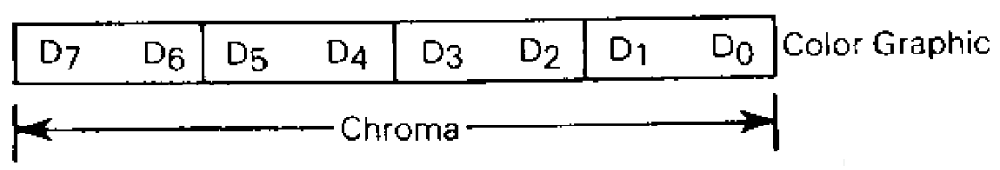
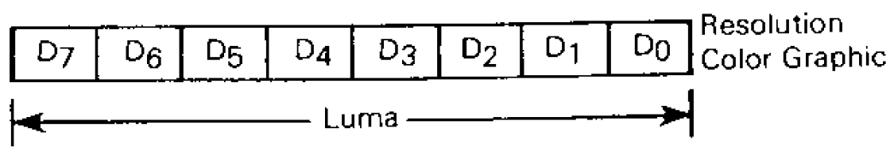
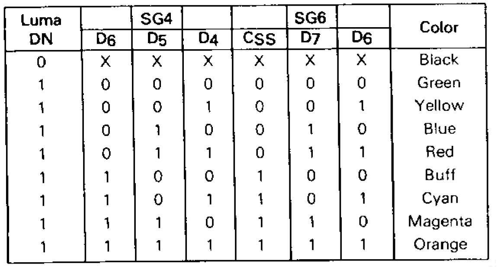
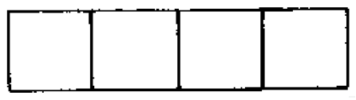

```
C090: 8E 06 00     LDX #$0600   Set X = $0600 (start of video memory)
C093: CC AA AA     LDD #$AAAA   Set D = $AAAA (blue)
C096: ED 81        STD ,X++     Store
C098: 8C 12 00     CMPX #$1200  
C09B: 26 F9        BNE $0096    Loop until $1200
```

Here we set all of the memory from `$0600` to `$1200` to the value `$AA`. As this constitutes 3K of data, or exactly half of the total video memory, we can deduce that the top of the screen is being painted a certain color.

Now would be a good time to see what values we need to set in memory to paint on the screen, so we turn to page 21 of the MC6847 VDG technical specifications.

### Graphics data formats
Each byte of data in video memory can be visualized like this:



D<sub>0</sub> to D<sub>7</sub> represent the individual bits in each byte. The byte is divided into four; each pixel on screen is represented by 2 bits. We'll look at what values those 2 bits should be shortly.

Remember that we've set the display mode to "color graphics"; in contrast, look at the data format for each byte if the display mode were set to "resolution graphics":



Again, D<sub>0</sub> to D<sub>7</sub> represent the individual bits, but here the byte is divided into eight; each pixel is represented by only one bit.

#### Color selection and chroma/luma
A mildly interesting note on terminology from the diagrams above: "chroma" refers to data that carries information about color; "luma" refers to achromatic, or "black-and-white", data. 

In "resolution graphics" mode we aren't working with colors, so our data can be defined as purely luma. On the CoCo, with only one bit per pixel, we can really only specify a 0 for "pixel off" and a 1 for "pixel on". In practice a 0 results in a green and a 1 results in a muddier green.

In "color graphics" mode we have 2 bits per pixel. The pixel color can be determined according to this table:



Firstly, look at the CSS column. This determines which of two system palettes we can use. Since we haven't set this it will be initialized to zero, so we get the default green/yellow/red/blue palette.

The D7 and D6 columns (not to be confused with the individual data bits discussed in the previous section) represent the 2 bits of data for each pixel. To take our specific code under consideration, we've set all of our bytes to `$AA`, which in binary is `1010 1010`. This means that each pixel has the first bit set to 1 and the second bit set to 0. This corresponds to the fourth line of the table, or **Blue**.

We have painted the sky blue.

#### What's a pixel in this case?
A final point: our pixels may not be quite what you think of today, where LCD screens have fixed physical pixels. On a raster TV, each pixel is drawn as an electron gun quickly fires horizontal lines across the screen. A pixel's width is therefore determined by the amount of time it takes to switch from one element of data to the next, while its height is measured in the number of horizontal scanlines it uses.

At a resolution of 128 x 192, each pixel is 2 VDG half-clock cycles wide (probably a few hundred nanoseconds) and one scanline high. Each pixel appears to be relatively chunky and wide, like this:


Other video modes, like CG2 at 128 x 64 (2 half-clock cycles x 3 scanlines), are even chunkier, but do have a somewhat squarer shape e.g.


