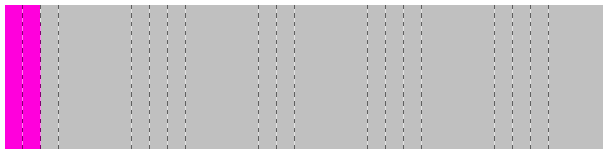
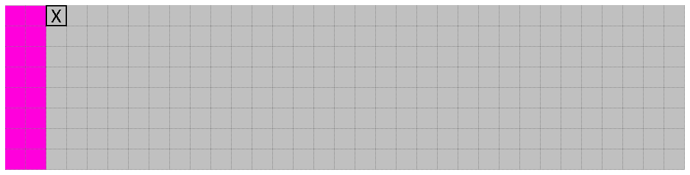

This routine is 90 bytes long, but relatively straightforward once unrolled.

```
D86C: 34 10        PSHS ,X    Push X ($1D00) to stack
D86E: A6 A0        LDA ,Y+    Set A = $46 (value at $C0A9), Y + 1
```

We immediately push X to the stack and read a byte from the address at Y. This suggests that these registers need to be set before we arrive here, so we can think of this routine as accepting two arguments, both of which are memory pointers. 

In our assembly comments, we've assumed that the function has just been called from `$C0A4`, where X was set to `$1D00` and Y was set to `$C0A9`. In our analysis of the memory at that point in the code, we guessed that the data at Y was ASCII text, and the data at X was uninitialized memory ([see the post here]() for more details) We can therefore label these two parameters:

<div>$$
X = \mathtt{destination\_address} \\
Y_1 = \mathtt{ascii\_character\_address}
$$</div>

I've designated <span>$Y_1$</span> instead of <span>$Y$</span> because the Y register will be used to store a different variable later on.

### Special case for end-of-transmission byte
```
D870: 81 04        CMPA #$04   Compare A (ascii_character) to 4 (end-of-transmission)
D872: 27 51        BEQ $D8C5   Jump to end if A = end-of-transmission
```

When the character we read is equal to `04`, we jump to the very end of the routine, i.e. immediately exiting. This indicates that the byte `04`, which does appropriately correspond to "end of transmission" in ASCII, marks the end of the chunk of data that we're reading.

### Special case for spaces (' ')
```
D874: 81 20        CMPA #$20    Compare A to $20 (' ')
D876: 26 18        BNE $D890    Jump to $D890 if A != ' '
D878: 86 08        LDA #$08     Set A = 8 (counter)
D87A: 34 02        PSHS ,A      Push A to stack
D87C: CC 00 00     LDD #$0000   Set A & B to 0
D87F: ED 84        STD ,X       Store 0000 at destination_address
D881: 30 88 20     LEAX +$20,X  destination_address + 20
D884: 6A E4        DEC ,S       counter - 1
D886: 26 F7        BNE $D87F    Loop while counter > 0
```

If the byte loaded is a space (i.e. `' '`), we enter a fairly simple loop which zeroes out the memory at `destination_address`. Makes sense; a space is not visible so we're probably loading pure zeroes to our destination RAM in order to not render it.

The only thing that might seem a bit strange (for now) is that we're incrementing the destination address by 32 bytes for each of the 8 loops, so it has gaps in memory somewhat like this:



```
D888: 32 61        LEAS +$01,S  Pop stack & discard
D88A: 30 89 FF 02  LEAX $FF02,X Reset destination_address to original offset + 2
D88E: 20 DE        BRA $D86E    Jump
```

Here we reset the stack to its original position and also reset the `destination_address`. Since during our looping we incremented it 256 bytes, now we move it backwards 254 bytes so that it sits at first uninitialized location in memory from the original offset:



This is implemented by *adding* the 2's-complement of `$0x00FE`, which is `$0xFF02`.
**TODO: more explanation of subtraction using 2's-complement**

### Special case for question marks ('?')
```
D890: 81 3F        CMPA #$3F  Compare A to 63 ('?')
D892: 26 0C        BNE $D8A0  Jump to $D8A0 if A != 63
D894: 34 20        PSHS ,Y    Push ascii_character_address to stack
D896: 10 8E D8 C7  LDY #$D8C7 Set Y = $D8C7
D89A: 86 08        LDA #$08   Set A = 8 (counter)
D89C: 34 02        PSHS ,A    Push A to stack
D89E: 20 10        BRA $D8B0  Jump
```

Again, we perform some special logic if the byte is the ASCII code for a question mark.

At this point, we introduce another new variable which is, again, another memory address in the cartridge ROM. Based on all we know so far, we might have suspicions about what lies there -- but let's continue for now. 

We store this variable in address register Y. This register already contains `ascii_character_address`, but since we've already loaded the data from there, we don't need the address right now - so we push it to the stack to make way for our new variable. 

We'll call this new variable <span>$Y_2$</span> until we know what it's for.

<div>$$
Y_2 = \mathtt{unknown}
$$</div>

For a question mark, we hardcode this address to `$D8C7`. This is a clue. When dealing with sets of ASCII characters, we can usually deal with alphanumerics in a generic way because they're coded contiguous i.e.

| code | character |
|:----:|:---------:|
|  65  |     A     |
|  66  |     B     |
|  67  |     C     |
|  68  |     D     |
|  69  |     E     |
|  70  |     F     |
|  71  |     G     |
|  72  |     H     |

or

| code | character |
|:----:|:---------:|
|  48  |     0     |
|  49  |     1     |
|  50  |     2     |
|  51  |     3     |
|  52  |     4     |
|  53  |     5     |
|  54  |     6     |
|  55  |     7     |
|  56  |     8     |
|  57  |     9     |

The question mark, on the other hand, is the only non-alphanumeric character apart from a space that I can recall the game displaying. Whatever data it is we need for the question mark simply lies at the arbitrary location of `$D873` and we accordingly point directly to it.

### General case for alphabetics
```
D8A0: 34 20        PSHS ,Y     Push ascii_character_address to stack
D8A2: 80 41        SUBA #$41   Set A = ascii_character - 65
D8A4: C6 10        LDB #$10    Set B = 16
D8A6: 3D           MUL         (ascii_character - 65) x 16
D8A7: C3 D9 77     ADDD #$D977 + $D977
D8AA: 1F 02        TFR D,Y     Set Y = result
```

As for the question mark, we first push `ascii_character_address` to the stack to get it out of the way. We then load <span>$Y_2$</span> with the seemingly arbitrary address `$D977`. However, we then additionally offset it according to where it appears in the set of all characters A to Z:

<div>$$
Y_2 = \mathtt{$D977} + ((\mathtt{ascii\_code} - 65)\times16)
$$</div>

The magic number 65 (`$41`) corresponds to the ASCII code for the letter A. The calculated addresses therefore end up looking like this:

<div>$$
Y_{2A} = \mathtt{$D977} + ((65 - 65)\times16) = \mathtt{$D977} \\
Y_{2B} = \mathtt{$D977} + ((66 - 65)\times16) = \mathtt{$D987} \\
Y_{2C} = \mathtt{$D977} + ((67 - 65)\times16) = \mathtt{$D997} \\
... \\
Y_{2Z} = \mathtt{$D977} + ((90 - 65)\times16) = \mathtt{$DB07} \\
$$</div>

```
D8AC: 86 08        LDA #$08   Set A = 8 (counter)
D8AE: 34 02        PSHS ,A    Push A to stack
D8B0: EC A1        LDD ,Y++   Set D = data from Y2, Y + 2
D8B2: ED 84        STD ,X     Store data at destination_address
D8B4: 30 88 20     LEAX +$20,X  destination_address + $20
D8B7: 6A E4        DEC ,S     counter - 1
D8B9: 26 F5        BNE $D8B0  Loop while counter > 0
```

Similar to what we did with the special case of the space (' '), we read the 16 bytes starting from the address at <span>$Y_2$</span> sequentially, but then place them 32 bytes apart at the destination address e.g. `$1D00`, `$1D20`, `$1D40` etc.

```
D8BB: 32 61        LEAS +$01,S  Pop stack and discard
D8BD: 35 20        PULS ,Y      Pop ascii_character_address into Y
D8BF: 30 89 FF 02  LEAX $FF02,X Reset destination_address to original offset + 2
D8C3: 20 A9        BRA $D86E    Loop to beginning
```

This is mostly cleanup code to reset our stack and restore the variables that we had at the beginning of the function. Then we loop right back to the beginning to start the whole process again with the next ASCII character we're loading.

```
D8C5: 35 90        PULS ,X,PC   Return
```

Finally, we return to the caller, additionally popping the X register off the stack to tidy up. These two actions could be written as two separate instructions:

```
PULS ,X
RET
```

However, since popping from the stack into the program counter does exactly the same thing as a `RET`, we can save a byte by combining the two pops into one.