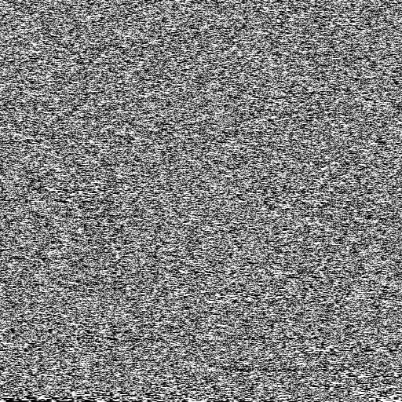

```
DB1B: B6 26 FA     LDA $26FA  Set A = data at $26FA (1111 1111)
DB1E: 48           ASLA       << 1 = 1111 1110 ($FE)
DB1F: 48           ASLA       << 1 = 1111 1100 ($FC)
DB20: 48           ASLA       << 1 = 1111 1000 ($F8)
DB21: B8 26 FA     EORA $26FA XOR =  0000 0111 ($07)
DB24: 48           ASLA       << 1 = 0000 1110 ($0E)
```

Now that's an interesting set of bitwise manipulations.

One clue about what we're doing here is that after this the value in the accumulator is not used for anything. We spend 5 operations shifting and XORing the data from `$26FA`, but we don't store the result back to memory, nor do we read it again. 

The only effect we can say it *does* have is that the final arithmetic left shift could set any of these processor condition codes:

 - Z (zero): set to 1 if the shift results in a zero for the entire byte
 - N (negative): set to 1 if the shift results in a negative number for the entire byte (i.e. MSB is 1)
 - V (overflow): set to 1 if the shift results in a sign change from + to - or vice-versa for the entire byte (i.e. MSB changes from 0 to 1 or 1 to 0)
 - C (carry): set to the previous value of the MSB i.e. the bit pushed out from the left-hand side

Which of these might we care about? It's hard to say because we haven't worked out what we're doing yet.

Let's look ahead to the next instructions for a clue.

```
DB25: 79 26 FD     ROL $26FD  rotate byte 4 left
DB28: 79 26 FC     ROL $26FC  rotate byte 3 left
DB2B: 79 26 FB     ROL $26FB  rotate byte 2 left
DB2E: 79 26 FA     ROL $26FA  rotate byte 1 left
```

We take each of our original 4 bytes of memory, starting from the right-most byte and ending with the left-most byte, and move them each one bit to the left. As these are rotate-through-carry operations, a 1 pushed out of the high bit of `$26FD` will be pushed into the carry flag. The next rotate left on `26FC` pulls the carry flag bit into the low bit of `$26FC`, and pushes the next high bit of `$26FC` into the carry flag, and so on down the line, rippling across each byte. The net effect is that the entire four bytes are rotated as if they were a single 32-bit number. For example, those four instructions would tranform the first number below into the second:

```
    00111111011111110000111111111100 
    01111110111111100001111111111000 <-
```

We may also notice that the initial `ROL` of `$26FD` can only be affected by one condition code, which is the carry flag. This solves the mystery of what we were hoping to do with the result of the 6 operations from `$DB1B-DB24`: we were solely concerned with setting the carry-bit so that it might be rolled in as the low bit on `$26FD`.

So overall, this is *sort of* like rotating the whole 32-bit value, except that the new low-bit, created by the XOR, isn't all that easy to predict without looking at the individual bits. On average, 50% of the time it will be a zero, 50% of the time it will be a one. The resulting byte in `$26FD` becomes just as difficult to predict.

That's also a big clue about what we're doing, but let's keep going to the end of the function.

```
DB31: FC 26 FA     LDD $26FA  Set A & B = data at $26FA-26FB ($FFFF)
DB34: 26 0E        BNE $DB44  If $26FA & 26FB != 0, jump to $DB44
DB36: FC 26 FC     LDD $26FC  Set A & B = data at $26FC-26FD
DB39: 26 09        BNE $DB44  If $26FC & 26FD != 0, jump to $DB44
```

These four lines are pretty straightforward: if all 4 bytes are zero, we fall through to these three instructions:

```
DB3B: CC FF FF     LDD #$FFFF Set A & B = $FFFF
DB3E: FD 26 FA     STD $26FA  
DB41: FD 26 FC     STD $26FC
```

These lines are identical to those from `$C016-C01E`, which first set these four bytes. It seems as if we're reseeding these four bytes of memory with their original values. This makes sense; a zero across all bytes is the only value that will generate nothing but more zeroes. It's sort of like the "poison" number in the context of this routine, so we can't allow it.

```
DB44: B6 26 FD     LDA $26FD  Set A = data at $26FD (byte 4)
DB47: 39           RTS        Return
```

Before we return, we set the accumulator to the fourth byte. Callers are probably not interested in all four bytes, just one.

Here's a transcription of the function to C:

```cpp
uint8_t register_A = 0;
uint8_t carry_bit = 0;
uint8_t byte_A = 0xFF; // $26FA
uint8_t byte_B = 0xFF; // $26FB
uint8_t byte_C = 0xFF; // $26FC
uint8_t byte_D = 0xFF; // $26FD

uint8_t func_DB1B()
{
    register_A = byte_A;

    asm_ASL(&register_A);
    asm_ASL(&register_A);
    asm_ASL(&register_A);
    register_A ^= byte_A;
    asm_ASL(&register_A);

    asm_ROL(&byte_D);
    asm_ROL(&byte_C);
    asm_ROL(&byte_B);
    asm_ROL(&byte_A);

    if (byte_A == 0 && byte_B == 0 && byte_C == 0 && byte_D == 0)
    {
        reset_bytes();
    }

    return byte_D;
}

// Rotates a given byte one bit to the left, taking the carry_bit as the LSB and
// storing the old MSB back to the carry_bit
void asm_ROL(uint8_t* i)
{
    uint8_t new_carry_bit = (*i & 0x80) >> 7;
    *i = (*i << 1) + carry_bit;
    carry_bit = new_carry_bit;
}

// Shifts a given byte one bit to the left. Like asm_ROL, this sets the carry-bit, 
// but does not use it (the LSB is always set to 0).
void asm_ASL(uint8_t* i)
{
    carry_bit = (*i & 0x80) >> 7;
    *i <<= 1;
}
```

Having reached the end of the function, do we have a better idea of what it does? Let's look at the bigger picture for two more clues:

1. This subroutine is called fairly frequently, generally at least a few times per frame
2. The values at `$26FA-26FD` are only very rarely written to; only when the machine is reset, or a new game is started.

So: the function iterates a lot, rarely resets, feeds back into itself (via the rotations) and generates numbers in an apparently unpredictable manner. Let's come out and say it: it looks an awful lot like a random number generator.

### Is it any good?

I was curious to see how well a relatively simple algorithm like this works as a random number generator. There seem to be various statistical means to test randomness, including the user of "p-values", however a more fun (if less rigorous) technique is to create an image composed of the algorithm's randomness. It's pretty straightforward, especially when we only need to test a single byte:

1. Determine how big an image you want. Let's say, 512 x 512 pixels.
2. Iterate the random function once for each pixel (i.e. 512 x 512 = 262,144 iterations).
3. Call the random function and read the resulting byte.
4. Write a pixel with R, G and B values equal to the byte value. 

We'll end up with a map of all the numbers generated. A 0 will have resulted in a pure black pixel, a 255 will have resulted in a pure white pixel, and anything in between will be a gray-scale pixel. For reference, here's the map generated in a short C# program which uses the [Random.Next()](https://msdn.microsoft.com/en-us/library/2dx6wyd4%28v=vs.110%29.aspx%20Random.Next%28%29) function:

```csharp
using System;
using System.Drawing;
using System.Drawing.Imaging;

namespace RandomToBitmap
{
    class Program
    {
        static void Main(string[] args)
        {
            var outputPath = args[1];
            var random = new Random();
            using (var bitmap = new Bitmap(512, 512, System.Drawing.Imaging.PixelFormat.Format32bppArgb))
            {
                for (int y = 0; y < 511; y++)
                {
                    for (int x = 0; x < 511; x++)
                    {
                        var value = random.Next(0, 256); // 0 inclusive, 256 exclusive
                        bitmap.SetPixel(x, y, Color.FromArgb(value, value, value));
                    }
                }
                bitmap.Save(outputPath, ImageFormat.Bmp);
            }
        }
    }
}
```


([original](../images/random_512x512_csharp.bmp))

That looks pretty random. Here's the map generated by a C program that emulates the algorithm used in Starblaze:


([original](../images/random_512x512_bitmap1.bmp))

Urgh. There are no obvious repeating patterns, but it doesn't look great. You can see it's a bit clumpy. Even if adjacent values aren't identical, they do tend to be a reasonably similar shade i.e. a number is often fairly close to the previous number.

That shouldn't really surprise us though, because each iteration only moves the data 1-bit to the left. This means that, each iteration, each byte will be at least seven-eighths of the same bits as before, and even though those bits are in a different position, the final value is frequently close.

If we run 8 iterations of the function before reading the byte - in effect, allowing all bits to be completely replaced - we get this:


([original](../images/random_512x512_bitmap8.bmp))

A *much* better looking map. I'm actually surprised at how good it looks. There are no obvious repeating patterns, and the range of values appears to be broad and, well, random.

On the other hand, it definitely needs a bit of "warming up" before the results start to look random. The graph below shows the results of the first 100 iterations:


Yikes. Frequently at or near 0 and 255 all the time. By the time we've reached iteration 9000 it's starting to look much better:


The other thing to note, of course, is that this is really only a pseudo-random-number generator. It will provide the same numbers every time the game is run, and they are always determinable.