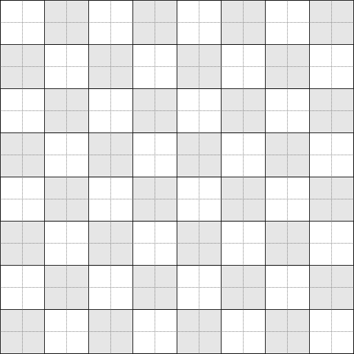
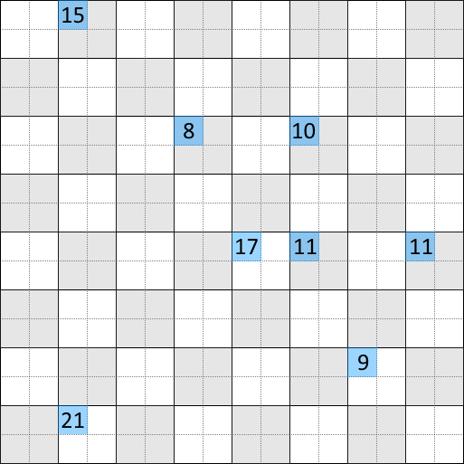

```
COAE: C6 08        LDB $08    Set B = 8
C0B0: 34 04        PSHS B     Push B to stack
```

We first put `08` on the stack, but we don't use it immediately, so let's not worry about it. We'll get it back later, but in the meantime the B register needs to be used elsewhere.

```
C0B2: BD DB 1B     JSR $DB1B  Call $DB1B
C0B5: 81 40        CMPA #$40  A - 64
C0B7: 24 F9        BCC $00B2  Call $DB1B until A < 64
```

We invoke the function at `$DB1B` until it puts a number in the accumulator that's less than 64. [See here for a full explanation of this function.]()

We're evidently looking for a random integer between 0 and 63, but a limitation of our random number generator is that it only generates random numbers in the range 0 to 255. There are a couple of possible ways to compensate for that in this case:

 - Divide the number by 4, ensuring a maximum of 63. While division can be computationally expensive, dividing by 4 would only involve two arithmetic right-shifts (`ASR`), or
 - Keep trying until we happen to get a number less than 64.

The latter method is used here. To be honest, as that method requires an indeterminate number of cycles to complete, I myself would have preferred a simple division by 4. But let's press on.

```
C0B9: 8E 25 19     LDX #$2519  Set X = $2519
C0BC: 48           ASLA        A * 2
C0BD: 48           ASLA        A * 2
```

Now we multiply our number by 4. We just made sure that it was less than 63, so now this operation pushes it back to the original range of 0 to 255. Why didn't we just keep our original random number? The only reason would be that we need a number that's a multiple of 4 i.e. which is actually a random number in the set:

<div>$$
\{0, 4, 8, 12, ..., 252\}
$$</div>

If that's all we want, it strikes me that we could have replaced *all* of `$C0B2-C0BD` with a much smaller and cheaper alternative:

```
C0B2: BD DB 1B     JSR $DB1B  Call $DB1B
C0B5: 84 FC        ANDA #$FC  Mask with 1111 1100
```

The AND mask on the accumulator zeroes out the lower 2 bits, ensuring a multiple of 4. For example, suppose our random number were 47 (`0010 1111`), it will be rounded down to 44 (the next lowest multiple of 4):

<div>$$
\begin{array}{r@{\,}r}
      & \mathtt{0010\ 1111} & (47) \\
    \land & \mathtt{1111\ 1100} & (252) \\
    \hline
      & \mathtt{0010\ 1100} & (44) \\
\end{array}
$$</div>

Again, the original method works and there will not be any noticeable difference to the end user.

```
C0BE: 1F 89        TFR A,B     Copy A to B
C0C0: 3A           ABX         X = X + B
C0C1: 6D 84        TST ,X      Examine byte at X
C0C3: 26 ED        BNE $C0B2   Loop to top until data at X = 0
```

We offset the address in X by our number. Since this is in multiples of 4, we'll be checking one of the addresses in this range:

<div>$$
\{\mathtt{$2519}, \mathtt{$251D}, \mathtt{$2521}, ..., \mathtt{$2615}\}
$$</div>

In other words, we seem to be dealing with 64 memory blocks, each 4 bytes wide. Since it makes things easier, let's visualize these data blocks as a 64-square board in which each square has 4 bytes:



When we find that the data at the address is non-zero, we go right back to the beginning and choose a different random number. We can guess from this that we're trying to populate an exact number of these memory blocks, so we don't want to write data into any block that we've already written to.

```
C0C5: BD DB 1B     JSR $DB1B  Call random_next()
C0C8: 27 FB        BEQ $C0C5  Loop random_next() until A != 0
C0CA: 81 08        CMPA #$08  A - 8
C0CC: 25 F7        BCS $C0C5  Call random_next() until A >= 8
```

This iterates the random_next() function until it gives us a number that's not equal zero and then, subsequently, until it's a number greater than or equal to 8. (Note that the `BCS` -- "branch on carry set" -- is the reverse counterpart to the `BCC` seen at `$C0B7`.)

I have to again be critical here: is the `BEQ` ("branch on zero") necessary? I'd say not; the `BCS` checking for a number less than 8 surely covers exactly the same case.

```
C0CE: F6 27 00     LDB $2700  Set B = skill_level
C0D1: 58           ASLB       B * 2
C0D2: CB 10        ADDB #$10  B + 16
```

We previously established that `$2700` represented the skill level between 1 (easiest) and 8 (hardest). We now initialize a new variable based on that:

<div>$$
b = (\mathtt{skill\_level} \times 2) + 16
$$</div>

It's a simple equation which will result in one of these values:

| skill_level | value       |
|:-----:|:----:|
|   1   | 18 |
|   2   | 20 |
|   3   | 22 |
|   4   | 24 |
|   5   | 26 |
|   6   | 28 |
|   7   | 30 |
|   8   | 32 |

```
C0D4: 34 04        PSHS ,B    Push B to stack
C0D6: A1 E0        CMPA ,S+   A - stack value, discard top of stack
```

The end result of these two operations is a comparison of register A to register B, something akin to a `CMPA ,B` instruction. Unfortunately such an instruction does not exist; other processors might offer such an operation, but the 6809 does not provide direct register-to-register comparison. We have to work around that by loading one of the registers into memory first, and then we can perform a register-to-memory comparison.

We can also tell that the B register is only pushed to stack memory very temporarily because the following instruction concludes by moving the stack pointer up one. This is generally analagous to "pop the stack and throw away the result".

```
C0D8: 22 EB        BHI $C0C5  Loop to $C0C5 until A <= B
C0DA: A7 84        STA ,X     Store A to X
```

We again wish to limit our random number to a particular range, and if it doesn't fit that particular range, we keep generating a random number until it does. The combined branching logic of `$C0CC` and `$C0D8` limit our range to:

<div>$$
8 \leq A \leq (\mathtt{skill\_level} \times 2) + 16
$$</div>

So when on the easiest skill level:

<div>$$
8 \leq A \leq 18
$$</div>

And on the hardest skill level:

<div>$$
8 \leq A \leq 32
$$</div>

```
C0DC: 6A E4        DEC ,S       stack value - 1
C0DE: 26 D2        BNE $C0B2    Loop until stack value == 0
C0E0: 32 61        LEAS +$01,S  Discard top of stack
```

Remember the number 8 that we stored on the stack way back at `$C0B0`? We're using it at last, as a loop counter. That means that we repeat this whole process 8 times, resulting in the 8 values being set in our board of values. For example:

